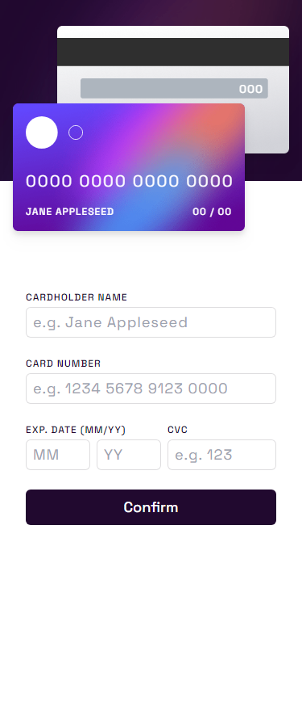

# Frontend Mentor - Interactive card details form solution

This is a solution to the [Interactive card details form challenge on Frontend Mentor](https://www.frontendmentor.io/challenges/interactive-card-details-form-XpS8cKZDWw). Frontend Mentor challenges help you improve your coding skills by building realistic projects.

## Table of contents

-   [Overview](#overview)
    -   [The challenge](#the-challenge)
    -   [Notes](#notes)
    -   [Screenshots](#screenshots)
    -   [Links](#links)
-   [My process](#my-process)
    -   [Built with](#built-with)
    -   [What I learned](#what-i-learned)
-   [Author](#author)

## Overview

### The challenge

Users should be able to:

-   Fill in the form and see the card details update in real-time
-   Receive error messages when the form is submitted if:
    -   Any input field is empty
    -   The card number, expiry date, or CVC fields are in the wrong format
-   View the optimal layout depending on their device's screen size
-   See hover, active, and focus states for interactive elements on the page

### Notes

Instead of showing an error message on form submition, I chose to use a regex and React controlled inputs, to try and guide the user into what the form expects as input.

This, in my opinion, allows for a smoother UX as it leaves very little for the user to think about. Just type the card info, and don't worry about the format.

### Screenshots

 

### Links

-   Solution URL: [Add solution URL here](https://your-solution-url.com)
-   Live Site URL: [Add live site URL here](https://your-live-site-url.com)

 

## Built with

-   [React](https://reactjs.org/)
-   [Vite](https://vitejs.dev)
-   [TailwindCSS](https://tailwindcss.com)

## Author

-   Frontend Mentor - [@tsukiongithub](https://www.frontendmentor.io/profile/tsukiongithub)
-   Twitter - [@scfd_tsuki](https://www.twitter.com/scfd_tsuki)
